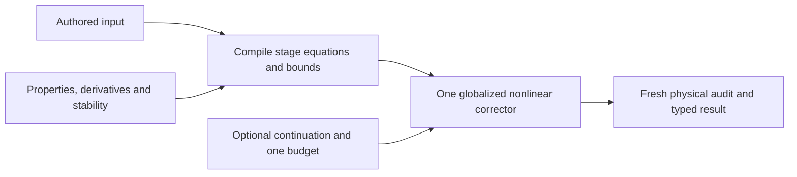

# Fundamental solver weaknesses and a replacement design

2026-09-05. Reviewed current commit `6c7d446`, shared by `main` and `codex/v3-convergence-fixes`. This is an analysis and proposal, not a rewrite implementation. It uses current source, the completed benchmark, the longer-deadline replay, three GPT-5.6 Terra/high code reviews, and primary numerical/process-modeling references. No new column benchmark was run for this review.

**Recommendation: replace the numerical core behind the existing user-facing interface.** Retain the property data, thermodynamic calculations that pass independent qualification, authored specifications, stream conventions, and conservation requirements. Replace the state/phase formulation, derivative assembly, convergence contract, and nested recovery policy together. A small diagnostic repair is useful preparation; more recovery rules should not be the main development strategy.

This is a recommendation to build and qualify a replacement, not evidence that an unbuilt solver will reach a particular success rate. The existing solver remains the production reference until the replacement passes explicit correctness and convergence gates.

## What the evidence establishes

The optimization reduced elapsed time by 33.3% on 12 shared-success cases. Under the 60-second benchmark deadline, acceptance rose from 26/64 to 27/64. The sole additional case also succeeds on the old main revision with a longer allowance, in 83.3 seconds. No typed main `NONCONVERGENCE` became a candidate success.

All 16 cases at 40% draw loading and all 12 pressure-boundary cases still fail. Thirty of 32 candidate numerical failures terminate with maximum scaled residuals between 0.00958 and 0.4657, far above `1e-8`. These failures are not merely acceptable roots rejected by the final-step gate. The benchmark does not prove that all requested operating points have a physical steady state, or identify the dominant root cause of every failure.

The structural weaknesses below are independently visible in the code. Their existence justifies formulation experiments; their contribution to individual crude failures still needs isolation.

## 1. The state representation makes negligible amounts numerically important

Every retained liquid/vapor component flow is represented as `scale * exp(z)`. Every retained flow must remain positive, and its final log correction must be at most `1e-8`. See [coordinates](D:/Minecraft/Modding/1.21/CreateChemE/src/main/java/com/wormzjl/createcheme/science/column/v3/V3DryMeshCoordinateMap.java:72) and [step contract](D:/Minecraft/Modding/1.21/CreateChemE/src/main/java/com/wormzjl/createcheme/science/column/v3/V3ConvergenceEvidence.java:16).

For a trace component, hold bulk phase totals and fugacity coefficients locally fixed. Write liquid/vapor amounts as `l = exp(u)` and `v = exp(w)`. A local balance and equilibrium-ratio equation then have the approximate Jacobian

```text
                  u         w
material row    -l/s       -v/s
log VLE row      -1          1
```

Here `s` is the material-row scale. The common direction `(du,dw)=(1,1)` leaves the equilibrium ratio unchanged and changes the material row by only `-(l+v)/s`. As the local amount vanishes, this direction becomes weakly determined. The sparsity graph can still have full structural rank while the numerical system loses useful sensitivity.

The current code asks for an accurate relative answer along that direction. For example, changing a `1e-20 mol/s` flow by 1% produces about a 0.01 log step, despite an absolute change of only `1e-22 mol/s`. This is not fixed by faster LU, a global flow floor, or simply grouping the same logarithms into a different class.

**Replacement:** distinguish three cases explicitly: a globally absent species, a physically absent phase, and a tiny but physically positive local amount. Use scaled variables that admit closed bounds and physical absolute/relative error measures. Keep globally present species in the initial prototype; add approximate local elimination only with an explicit transport-loss budget and reinsertion rule. Do not silently drop material or infer insignificance from an unscaled Jacobian coefficient.

## 2. The phase model cannot represent part of the physical domain

[V3ColumnTopology](D:/Minecraft/Modding/1.21/CreateChemE/src/main/java/com/wormzjl/createcheme/science/column/v3/V3ColumnTopology.java:66) permits phase selection at the condenser but forces both hydrocarbon phases on all trays and the reboiler. Condenser phase correction is an external projection/retry. An interior phase cannot disappear merely because the nonlinear method becomes more sophisticated.

**Replacement:** phase status belongs to the governing model. Begin with an active-set formulation: solve a smooth fixed-phase problem, test phase stability, and rebuild the affected stage equations when a phase appears or disappears. Absent-phase compositions must not become unconstrained numerical unknowns. A semismooth/complementarity formulation is an alternative if active-set switching proves unreliable, not an additional simultaneous recovery mechanism.

The phase-transition policy must specify the stability criterion, a material-conserving state transfer, when the new branch is accepted, rollback on failure, an anti-chatter rule, and a bounded transition count under the same request budget. These are part of the one solver's state machine, not an unbounded outer retry loop.

IDAES provides a concrete cubic-EOS complementarity formulation for handling single- and two-phase states. It illustrates why phase amounts and phase conditions must be represented together; it does not prove that its particular formulation will solve this column. [IDAES cubic VLE formulation](https://idaes-pse.readthedocs.io/en/2.8.0/explanations/components/property_package/general/pe/smooth_vle2.html).

The current auditor also requires strictly positive flows on those fixed phases. It must therefore be versioned for the new model. Preserve conservation, energy, authored specifications, and stability checks; do not force a valid zero-phase result through a contract that forbids it.

## 3. Side draws introduce a hidden feasibility boundary

The material and energy equations use the fraction `D/L`, while `D < L` is checked at final acceptance. A Newton trial can consequently produce negative continuing downflow while its individual log-mapped component flows remain positive. See [withdrawal](D:/Minecraft/Modding/1.21/CreateChemE/src/main/java/com/wormzjl/createcheme/science/column/v3/V3ColumnProblem.java:196) and [material/energy equations](D:/Minecraft/Modding/1.21/CreateChemE/src/main/java/com/wormzjl/createcheme/science/column/v3/V3MeshResidualEvaluator.java:90).

**Replacement:** make continuing liquid flow a primary physical quantity:

```text
B >= 0                 continuing downflow
L = B + D              gross liquid leaving the equilibrium contact
downflow component i = B * x[i]
draw component i     = D * x[i]
```

This removes the `D/L` division from interstage transport. Mass and energy use the same split definition. A zero continuing flow is not necessarily an absent liquid phase: when `D > 0`, liquid still leaves through the draw. Decide explicitly whether zero continuing flow is supported; do not silently change the legacy strictly-positive-downflow regime or introduce an arbitrary positive floor.

If zero continuing flow is supported, the downstream liquid edge is exactly disconnected. The downstream stage still receives any vapor, feed, or other supported transport, and its own phase equations must determine whether liquid can exist there. The compiler and audit must represent this boundary consistently.

This is a stronger formulation change than rejecting selected trial states afterward. It still cannot make an infeasible requested draw physically possible.

## 4. Thermodynamic phase selection and derivatives need a stronger contract

The [feed flash](D:/Minecraft/Modding/1.21/CreateChemE/src/main/java/com/wormzjl/createcheme/science/column/v3/thermo/V3FeedFlash.java:17) can return single-phase results directly from a Wilson K-value endpoint test. That is not a full thermodynamic stability calculation. The same property machinery contributes to initialization and condenser checking, so agreement between them is not an independent stability proof. The present [thermo interface](D:/Minecraft/Modding/1.21/CreateChemE/src/main/java/com/wormzjl/createcheme/science/column/v3/thermo/V3ThermoModel.java:6) returns values but does not expose the derivatives and branch-validity information a robust corrector needs.

**Replacement:** retain the PR data/kernel subject to independent validation, but add a tested phase-stability/flash layer and a derivative-capable stage-property interface. It should return enthalpy, fugacity data, derivatives with respect to temperature/composition, selected phase/root, and an explicit indication of derivative ill-conditioning near root coalescence. Use analytic derivatives or automatic differentiation within a fixed smooth branch. Differentiating a branch-selection operation blindly does not make its derivative meaningful.

Finite differences remain a reference and a declared fallback during development. Compare directional derivatives across step sizes and against an independently assembled small model; never replace an unavailable derivative with zero.

## 5. The wet model has a restricted physical scope

Water is not a solved MESH component. Its upward vapor profile is prescribed from steam feeds; hydrocarbon equilibrium gets a dilution correction, and a later dew-point audit rejects tray water condensation. The source explicitly says three-phase trays are outside the contract. See [water checks](D:/Minecraft/Modding/1.21/CreateChemE/src/main/java/com/wormzjl/createcheme/science/column/v3/V3AcceptanceAuditor.java:75).

That can be a useful declared steam-stripping approximation. It is not a general hydrocarbon/water phase-equilibrium model. A rewrite should initially reproduce that scope honestly and return `UNSUPPORTED_PHASE_REGIME` when it is violated. If broader wet operation is required, add solved water balances and a qualified aqueous/immiscible-water model, including latent heat and phase appearance. A full nonideal water/hydrocarbon model additionally needs validated interaction/property data. Adding water to an uncalibrated PR mixture is not sufficient evidence of accuracy.

In the initial restricted model, new stability checks concern the hydrocarbon phases. Water retains its explicit dew-point/domain check; full water-containing phase stability is not claimed until solved water balances and the corresponding property model are present.

## 6. Numerical recovery is compensating for missing model structure

The code combines dense/colored finite differences, a separate local-block predictor, direct Newton, normal-equation damping, gradient recovery, coarse differences, initialization modes, stage/pressure ladders, draw/steam ramps, condenser correction, and truncation retry. Several mechanisms revisit the same difficult formulation.

The [finite-difference path](D:/Minecraft/Modding/1.21/CreateChemE/src/main/java/com/wormzjl/createcheme/science/column/v3/V3FiniteDifferenceJacobian.java:95) still builds a dense `n × n` array despite known stage locality. The normal-equation fallback forms `JᵀJ`; in ill-conditioned problems this can square the condition number. [LAPACK discussion of normal equations](https://www.netlib.org/lapack/lawnspdf/lawn149.pdf).

**Replacement:** use one stage-local derivative assembly and one globalized corrector. Store the diagonal and adjacent-stage Jacobian blocks directly. Use tested pivoted sparse/banded LU for regular Newton systems; use a rank-aware QR/least-squares formulation when that is the declared step problem, without explicitly forming normal products. Block Thomas elimination without sufficient pivot protection is not a general substitute.

Choose one bounds-aware trust-region or filter/globalized Newton implementation. Let its step control respond to model accuracy, rank, and feasibility. Remove the separate local/coarse/gradient numerical personalities once their coverage is replaced. Trust-region methods are established nonlinear-solver options, but their existence is not a guarantee of convergence here. [PETSc nonlinear solver methods](https://petsc.org/main/manual/snes/).

## 7. The success certificate describes the wrong mathematical object in one path

The [final verification fallback](D:/Minecraft/Modding/1.21/CreateChemE/src/main/java/com/wormzjl/createcheme/science/column/v3/V3SimultaneousColumnSolver.java:362) can attach the backward error of a damped normal system to a claimed final Newton correction. The manufactured counterexample already reproduces this defect. A small residual, a small step, a regularized-system solution, and a stable physical equilibrium are distinct evidence.

**Replacement:** define success by freshly recomputed physical residuals, authored constraints, phase stability, and declared approximation budgets. Use separate physically scaled state-step measures for progress/stagnation. If a linear certificate is reported, calculate its residual against the actual named linear system. A rank-deficient small-residual root may require a sensitivity warning; a stationary least-squares point with significant residual is failure.

KINSOL explicitly distinguishes residual convergence from a small step that may indicate stalling, and supports separate variable/residual scaling. Those distinctions are useful contract precedents; its default tolerances should not be copied into this model without physical error analysis. [KINSOL mathematical considerations](https://sundials.readthedocs.io/en/latest/kinsol/Mathematics_link.html).

## 8. Continuation and reporting need to become simple control code

The current fixed draw ramp can seed full loading from a failed partial rung. Mandatory pressure anchors can stop before the authored problem is attempted. Individual iteration budgets multiply across routes, while public work counters are incomplete. Finally, constructing a long diagnostic string can replace the numerical result with `INVALID_INPUT`.

**Replacement:** one optional continuation controller, one request budget, and typed attempt records. Prefer continuation on the authored stage topology; keep the requested specifications immutable and distinguish intermediate problems from the target. Preserve the last accepted seed, adapt the continuation step, and stop honestly when the budget expires. No intermediate solution may be published as the requested solution. Record phase switches, limiting residual/coordinate, derivative failures, accepted/rejected steps, and actual property/Jacobian/factorization work. Render bounded strings from records after the outcome has been fixed.

## Recommended core formulation

For a present two-phase stage, one inspectable prototype uses `T`, continuing liquid `B`, vapor total `V`, and full compositions `x[1..C]`, `y[1..C]`, all with appropriate closed bounds. This gives `2C+3` unknowns. Use `C` component balances, `C` active-phase equilibrium equations, two composition-sum equations, and one energy balance: also `2C+3`. Eliminating one composition variable per phase gives the equivalent `2C+1` formulation, but requires careful simplex-bound handling.

This is a local stage count, not a proof of full-column closure. Compile and count the entire column, including condenser/reboiler boundaries, reflux/duty controls, feed and draw specifications, and each supported phase pattern.

Use gross liquid `L=B+D` in stage outflow and property accounting. For absent phases, remove undefined composition/equilibrium variables and replace phase equality requirements with the appropriate stability conditions. Handle condenser temperature, reflux splitting, and reboiler duty as boundary/specification equations. Recheck the active-set DOF count after a phase change. A numerical-rank test supplements the sparsity ledger.

Use a finite, amount-aware equilibrium representation or a tested local-flash elimination. Merely retaining every log-fugacity equation and log-step test after changing variable names reproduces the trace problem. Never apply log/softmax variables universally and then claim exact-zero support: those transformations still describe an open positive domain.

At a simplex face, use either a tested finite fugacity residual extension or explicit active-component equations with a re-entry rule; never evaluate `log(0)`. Approximate omission of a locally tiny, globally present species is distinct from exact global absence and must retain the declared material/error budget. Closed bounds alone do not provide this rule.

A proposed material-row normalization is `R_M / (absoluteAllowance_i + relativeAllowance_i * componentThroughputScale_i)`, with a corresponding energy allowance and a separate equilibrium/stability error policy. Allowances must come from the conservation/error budget and remain fixed during an individual linearization/trial comparison. Validate that global accumulated error meets the published limits. Do not increase allowances just to classify the existing failures as successes.



The compiler freezes units, pressure nodes, indices, sparsity, specifications, and property references. Runtime workspaces contain primitive arrays and request-local counters. Phase changes invalidate the affected compiled blocks and derivative caches. Preserve cancellation and stream IDs; version internal state/evidence and the public formulation identity where the old result types cannot express new phase states.

## Alternative worth a fair prototype: component-balance elimination / inside-out

For column-focused computation, an inside-out design can reduce the nonlinear problem substantially. It updates local thermodynamic models in an outer iteration and solves component balance systems within an inner energy/specification solve. This avoids treating every trace component amount as an independent global Newton coordinate. A published implementation shows the component-wise tridiagonal construction. [Inside-out formulation example](https://www.mdpi.com/2227-9717/8/5/604).

Its approximate property models must converge back to the full thermodynamic equations, and derivatives of eliminated balances must be treated consistently. Standard stripping factors such as `K*V/L` become problematic when a phase vanishes. Research on nonsmooth inside-out methods addresses such boundaries, but one published method also adjusts a selected input specification to obtain a physical boundary solution. **That specification adjustment is not acceptable as success for this application's unchanged request.** [Cavalcanti and Barton, phase-disappearance study](https://www.sintef.no/globalassets/project/higheff/deliverables-2020/d1.2_2020.01-distillation-simulation-robust-to-liquid-and-vapor-phase-disappearing.pdf).

| Approach | Main attraction | Main risk | Recommended role |
| --- | --- | --- | --- |
| Scaled constrained stage equations | Explicit physics/bounds, general specifications, inspectable derivatives | Active-set/stability and scaling must be correct; a new solver alone is insufficient | Preferred reference and first replacement prototype |
| Component elimination / inside-out | Smaller nonlinear problem and less repeated EOS work | Phase-boundary ratios, thermodynamic outer iteration, and elimination sensitivities | Serious competing column-core prototype |
| Pseudo-transient relaxation | A different path toward a steady state | Needs meaningful time/pseudo-time scales; does not cure a missing phase regime | Later initializer option if evidence supports it |
| More V3 recovery rules | Low initial implementation cost | Retains the same representation/certificate weaknesses | Only small diagnostic/seed fixes during transition |

Pseudo-transient continuation modifies the step problem with a time term; it is not merely ordinary steady Newton with more iterations. It must still finish at the original steady equations. [PETSc pseudo-transient method](https://petsc.org/main/manualpages/TS/TSPSEUDO/).

Use a mature external solver as an **offline reference**, before deciding whether to deploy a native dependency or a Java implementation. For example, Ipopt provides a constrained nonlinear-programming/filter method suitable for a fixed smooth prototype; a generic NLP solver does not by itself solve nonsmooth phase complementarity or prove global feasibility. [Ipopt documentation](https://coin-or.github.io/Ipopt/). The deployment choice should follow packaging, cancellation, numerical parity, and performance measurements.

## What to retain and retire

Retain the input/specification semantics, component/package data, units, stream identifiers, independent test fixtures, conservation requirements, cancellation boundary, and baseline measurements. Retain the PR kernel only to the extent supported by its independent property tests; add stability/derivative capabilities rather than assuming they already exist.

Retire the universal component log-flow map and its relative-only final-step contract, fixed interior-phase topology, dense production Jacobian, explicit normal-product rescue, solver-policy selection spread across the calculator, and string-based attempt identity. Replace audit implementation where needed for valid zero-phase states; retain or strengthen the physical obligations it checks. The old auditor remains useful for overlap cases but cannot be the sole oracle for the extended model.

## Qualification before replacement

1. **Truthful reference:** compact diagnostic paths, freeze exact resolved inputs including every node pressure, and retain current outcomes. Add dense small-system residual/Jacobian references and request-wide counters. No new recovery behavior is needed for this step.
2. **Single-stage foundation:** reproduce independent liquid-only, vapor-only, two-phase, and phase-boundary cases; distinguish metastable EOS roots from stable equilibrium. Test absent species, tiny positive components, and derivative behavior. Establish the water model scope explicitly.
3. **Small column prototypes:** implement the constrained and reduced/component-elimination candidates on the same small dry model. Exercise side draws up to the onward-flow boundary, trace amounts over many orders of magnitude, and phase changes from both directions. Compare original physical equations and derivatives, not solver-internal merit values.
4. **Decisive failed-case tests:** evaluate F06/F08 dry off/on and P99/P101 dry before another full campaign. Record whether the target was attempted, why it stalled, and all final residual/feasibility measures. A reduced wall time alone is not a convergence win. Failures need diagnosis; they need not all be physically feasible.
5. **Independent accuracy and wet extension:** use the Holland oracle plus independent small-column/property references. Cross-implementation agreement requires matching property data and assumptions. Add water condensation cases only when the new physical model supports them. Freshly recomputing the same buggy residual is not independence.
6. **Cutover:** rerun all shared-success controls, the corrected-size benchmark version, and targeted phase/trace cases. Reject repeatable accepted-solution losses, hidden specification changes, loosened conservation budgets, false success on a nonzero-residual stationary point, and unacceptable request cost. Keep production V3 until one replacement earns the switch; then remove obsolete recovery code.

Success criteria are improved audited target solves and simpler, explainable failure modes under the same work/deadline policy—not an invented percentage target or blanket expectation of 64/64 success. Multicore work should first parallelize independent cases; later stage/property or component-system parallelism must use isolated workspaces and measured granularity.

## Benchmark interpretation correction discovered in this review

The resolver defines condenser and tray 1 at `Ptop`, tray `j` at `Ptop+(j-1)*drop`, and the reboiler at tray N pressure. Thus the total pressure span is `(N-1)*drop`, not `(N+1)*drop`. See [pressure generation](D:/Minecraft/Modding/1.21/CreateChemE/src/main/java/com/wormzjl/createcheme/science/column/v3/V3ColumnProblemResolver.java:127).

The prior size manifest used `drop=23250/(N+1)` intending a constant span. Actual spans were 13,950; 18,083.33; 20,343.75; 21,750; and 22,534.62 Pa for N=4/8/15/30/64. Its paired main/candidate comparisons remain valid for the same inputs, but the claimed constant-span cross-size interpretation was wrong. Preserve that frozen run; a future manifest must store the resolved node pressures and use a new version if changing the inputs.

Related local evidence: [benchmark results](D:/Minecraft/Modding/1.21/CreateChemE/documentation/2026-09-05-v3-solver-core-review/V3_COLD_CORE_BENCHMARK_RESULTS.md), [convergence analysis](D:/Minecraft/Modding/1.21/CreateChemE/documentation/2026-09-05-v3-solver-core-review/V3_CONVERGENCE_ANALYSIS.md), [formulation review](D:/Minecraft/Modding/1.21/CreateChemE/documentation/2026-09-05-v3-solver-core-review/V3_REDESIGN_FORMULATION_NOTES.md), [numerical review](D:/Minecraft/Modding/1.21/CreateChemE/documentation/2026-09-05-v3-solver-core-review/V3_REDESIGN_NUMERICS_NOTES.md), and [alternative review](D:/Minecraft/Modding/1.21/CreateChemE/documentation/2026-09-05-v3-solver-core-review/V3_REDESIGN_ALTERNATIVES_NOTES.md).
