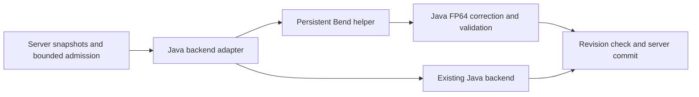

Bend solver feasibility — 2026-09-18

**Recommendation: retain Java for the production numerical solver.** A Bend adapter is technically plausible, but current Bend cannot preserve this project's numerical contract without substantial language/runtime work or moving the double-precision arithmetic into another language. Consider Bend only as an optional experiment for approximate, batched work whose outputs Java subsequently corrects and validates.

This assessment covers the V3 column solver, fluid-network interval solver, and shared Peng–Robinson kernel at local commit `c5c8af3`. It combines current upstream documentation/compiler inspection, local source inspection, existing benchmark reports, and a binary32 rounding calculation. No Bend installation, solver port, runtime benchmark, or production source change was performed. Historical timings below are identified by their original revisions; they are not measurements of today's checkout.

**Which Bend is being evaluated.** The linked site now points to Bend 2; the inspected CLI declares version 2.0.5. Its executable/C/JavaScript generation paths are visible in the [CLI source](https://github.com/bendlang/bend/blob/main/bend2/main.ts). Bend 1 and HVM programs do not carry over, so older Bend performance claims cannot establish the behavior of this version. Upstream explicitly lists missing native Windows support; WSL is the documented workaround. These are observations of mutable upstream `main` on the investigation date, not a pinned release qualification. [Upstream limitations](https://github.com/bendlang/bend#limitations).

**Numerical precision is the decisive obstacle.** The compiler maps F32 to a 32-bit representation and rounds JavaScript arithmetic through `Math.fround`; emitting C or JS does not turn it into a double-precision language. Native numeric types currently have no F64 implementation. [Compiler numeric lowering](https://github.com/bendlang/bend/blob/main/bend2/comp.ts).

| Existing contract | Source evidence | Consequence for a direct F32 port |
|---|---|---|
| Fluid Newton default tolerance `1e-8` | [SparseNewton.java](D:/Minecraft/Modding/1.21/CreateChemE/src/main/java/com/wormzjl/createcheme/science/fluid/solver/SparseNewton.java:40) | Binary32 spacing near one is about `1.19e-7`; cancellation and differencing need explicit numerical redesign. |
| V3 final linear backward error at most `1e-12`; historical log-flow closure `1e-8` | [V3ConvergenceEvidence.java](D:/Minecraft/Modding/1.21/CreateChemE/src/main/java/com/wormzjl/createcheme/science/column/v3/V3ConvergenceEvidence.java:21) | Loosening a gameplay closure setting does not remove the linear-algebra precision requirement. |
| Sparse LU backward-error threshold `1e-10`, including a double-ULP roundoff allowance | [SparseLuSolver.java](D:/Minecraft/Modding/1.21/CreateChemE/src/main/java/com/wormzjl/createcheme/science/fluid/linalg/SparseLuSolver.java:18) | The port needs to satisfy the existing error checks, not merely return similar-looking pressures. |
| PR cubic root classification and refinement; regression results within a few double ULPs of a 90-digit oracle | [PengRobinsonKernelRootPrecisionTest.java](D:/Minecraft/Modding/1.21/CreateChemE/src/test/java/com/wormzjl/createcheme/science/thermo/PengRobinsonKernelRootPrecisionTest.java:18) | Root selection and derivatives near coalescence are particularly sensitive. |

A small arithmetic check makes the loss concrete: the two `(A, B)` coefficient pairs already captured in that PR regression test both round to the identical binary32 pair `(0.3649214208126068, 0.022388335317373276)`. Separately, `100000.0` and `100000.001` Pa become the same binary32 number. At 300 K, binary32 spacing is approximately `3.05e-5` K, whereas the V3 temperature-step scale is `1e-6 + 1e-9*T`, or `1.3e-6` K there. These calculations demonstrate lost information, not a measured Bend solver failure. A small reported update can also result from rounding to zero, so apparent convergence alone would not establish accuracy.

An adapter that transports doubles cannot restore information once the arithmetic converts them to F32. Scaling and compensated sums can help selected operations but do not establish equivalence for this entire nonlinear solver. Software double arithmetic, paired floats, or a compiler fork are possible research projects; they require their own transcendental functions, root behavior, error analysis, and performance qualification. Calling an external C double-precision kernel instead leaves that numerical kernel in C.

**The proof benefit is narrower than the website suggests for this application.** F32 arithmetic and transcendental operations are opaque laws in the current [base library](https://github.com/bendlang/bend/blob/main/bend2/base.bend). They do not supply an arithmetic model from which to establish floating-point error bounds. Structural properties such as valid state transitions or ownership may be useful proof targets; nonlinear convergence, thermodynamic correctness, and numerical conservation would still need their own specifications, numerical arguments, and runtime checks. A proof of an ideal real-valued balance would not by itself certify its rounded implementation or the Java/native boundary.

**Parallelism is useful only where the workload exposes it.** Bend's native scheduler expects balanced independent fork/join calls. JavaScript execution is sequential; foreign effects execute on the host event loop rather than inside the pure GPU computation. [Language guide](https://github.com/bendlang/bend/blob/main/guide/GUIDE.md).

The following suitability judgments are inferences from that execution model and the local implementation:

| Candidate | Potential benefit | Main constraint | Assessment |
|---|---|---|---|
| Complete V3 Newton/continuation solve | Native execution and parallel stage calculations | Each iteration, line-search decision, phase/support change, and continuation stage depends on previous results | Poor first port; preserve FP64 and first identify remaining hot regions. |
| Complete fluid interval solve | Parallel work across independent islands | Adaptive substeps and iteration counts differ; cached workspaces and factors survive across jobs | Current Java service already exploits island-level independence. |
| Banded/sparse LU | Faster numeric kernels if a suitable algorithm and implementation win | Pivoting, triangular dependencies, sparse memory access, precision | Bend does not automatically provide a competitive sparse or banded factorization. |
| Batched property or stage-derivative evaluations | Independent evaluations can run together | Small component slates, data movement, mutable scratch ownership, FP64 requirement | Best future numerical experiment if native F64 becomes available. |
| Approximate initial guesses or offline parameter batches | F32 may be adequate when Java corrects every result | Divergence, batching latency, and end-to-end convergence rate | Most plausible experiment today; benchmark against the existing initializer. |

The shared [PengRobinsonKernel](D:/Minecraft/Modding/1.21/CreateChemE/src/main/java/com/wormzjl/createcheme/science/thermo/PengRobinsonKernel.java:7) is already allocation-free within a solve, reuses temperature work, and has a sparse-pair mixing option. The column [banded solver](D:/Minecraft/Modding/1.21/CreateChemE/src/main/java/com/wormzjl/createcheme/science/column/v3/linalg/V3BandedPivotedSolver.java:5) already uses a flat band array. A language rewrite must be compared with these implementations, not the older allocation-heavy versions.

**What the recorded performance data imply.** The [September 9 column investigation](D:/Minecraft/Modding/1.21/CreateChemE/documentation/2026-09-09-v3-convergence-time/convergence-time-optimization-2026-09-09.md:223) reports a Java-only improvement from 12.2–13.3 seconds to 1.5–1.8 seconds on the literature CDU preset. At its measured final revision, a 1.66-second solve included approximately 0.47 seconds of LU, 0.42 seconds of finite-difference verification Jacobians, 0.37 seconds of residual evaluation, and 0.19 seconds of analytic stage Jacobians.

That profile illustrates the limit of accelerating one kernel: making its LU **10 times faster** gives only `1.66 / (1.19 + 0.047) = 1.34x` overall before adapter overhead. Eliminating LU completely gives at most `1.39x`. These are calculations from an older profile, not forecasts for a Bend implementation.

The [fluid optimization review](D:/Minecraft/Modding/1.21/CreateChemE/documentation/2026-09-15-fluid-network/FLUID_SOLVER_OPTIMIZATION_REVIEW.md:14) records worker median latency falling from 56.6 ms to 3.28 ms and p95 from 122.5 ms to 5.88 ms after WP1–WP3 in its 100-island pool test. Later transient improvements were measured separately; that pool was not remeasured after WP6a–WP7. This distinction matters: millisecond quiet jobs and second-scale cold solves require different offload decisions. Per-property IPC calls would be especially unsuitable for the small jobs.

For a fraction `p` of baseline wall time accelerated by a factor `s`, with new overhead `h` expressed as a fraction of baseline wall time, the illustrative speedup is:

`speedup = 1 / ((1 - p) + p/s + h)`

With an 8x kernel improvement and zero new overhead, accelerating 25%, 50%, or 75% of the job yields only 1.28x, 1.78x, or 2.91x overall. Changed iteration counts can further improve or erase the gain. CPU core count and GPU throughput are not substitutes for measuring this end-to-end result.

**A feasible adapter design.** The current integration boundary is helpful: [BoundedCpuSolveService.SolveKernel](D:/Minecraft/Modding/1.21/CreateChemE/src/main/java/com/wormzjl/createcheme/runtime/BoundedCpuSolveService.java:550) accepts an immutable snapshot and cancellation token and returns a result. [ProcessSolveServices](D:/Minecraft/Modding/1.21/CreateChemE/src/main/java/com/wormzjl/createcheme/runtime/ProcessSolveServices.java:37) keeps Minecraft access on the server thread. An experiment can fit behind that boundary without moving world access into Bend.

| Adapter | Feasibility | Appropriate use |
|---|---|---|
| Persistent helper process with local IPC | Precompiled native executable; framed requests and responses; restart on failure | Best first experiment on Linux/macOS, or Windows through WSL as a development setup. |
| Generated C plus an explicit C ABI shim and JNI | Plausible but requires wrapping runtime initialization, allocation, invocation, cleanup, and cancellation | Consider only after an executable prototype demonstrates worthwhile gains. |
| Generated JS hosted by a JS runtime | Export/call path exists, but introduces another runtime and retains F32 semantics | Functional experiments, with no Bend multicore/GPU benefit. |

The CLI builds a complete executable, and the inspected documentation does not establish a supported Java binding or stable native embedding ABI. C output is an integration starting point, not a ready shared library API. [CLI implementation](https://github.com/bendlang/bend/blob/main/bend2/main.ts). JNI is compatible with this project's Java 21 target. Java's FFM API is still a preview feature in that specific JDK, so using it would add launcher/build requirements. [Java 21 FFM documentation](https://docs.oracle.com/en/java/javase/21/core/foreign-function-and-memory-api.html).

The proposed helper protocol would carry a schema version, request identity, model/component-basis identity, topology/input revision, workload dimensions, numeric buffers, deadline budget, result status, and diagnostic counters. Transport identities as opaque bytes rather than squeezing Java longs into Bend's smaller numeric types. Keep debug output separate from protocol output. A compact binary codec needs implementation; file/TCP effects alone do not provide it.

Offload one sizeable batch or an entire solve attempt. Do not cross the boundary for each scalar property call. Cache property data and any retained factors using revision-bound handles, preserving the exclusive per-island ownership already enforced by [RetainedSolver](D:/Minecraft/Modding/1.21/CreateChemE/src/main/java/com/wormzjl/createcheme/runtime/fluid/RetainedSolver.java:10).

Java must retain authoritative conservation, finiteness, convergence, and revision checks. Bound IPC waits; implement cooperative helper checkpoints and an owned-process termination path. Java interruption alone is not evidence that native work stopped. The documented event loop cannot service a cancel message while an uninterrupted pure calculation is still running, so cancellation granularity needs deliberate design. A helper crash or invalid response must become a terminal failure or a bounded Java retry against the original snapshot, never a partial world commit.

Assign one shared CPU budget across admitted jobs and Bend threads. Running every admitted island with all machine cores would undermine the existing bounded scheduler. First compare single-thread native kernels; test intra-solve parallelism only when capacity is deliberately reserved for it. GPU evaluation also needs CPU-only coverage and measurements with the game renderer active. WSL does not make a Linux shared library loadable into a Windows JVM; use IPC or undertake a native port.

**Expected benefit and decision gates.** For the production FP64 kernel, current net value is unfavorable: correctness and Windows distribution are unresolved, with no measured Bend speedup. For a large, uniform, approximate batch, throughput gains are plausible but unquantified. For structural proofs, benefits are selective and do not replace the existing scientific regression suite.

The most economical next step is a fresh profile of current Java under quiet islands, cold transients, and difficult column cases. If an offload candidate accounts for a substantial share, first measure a narrow FP64 native implementation or Java batching/parallelism against the same baseline. This isolates whether native execution or parallel hardware helps before taking on a language migration.

If pursuing Bend now, constrain the spike to a non-authoritative initializer or offline batch. Keep the existing Java backend as the reference and fallback. Use the same CPU allocation, inputs, and acceptance gates for every comparison; include serialization, helper/runtime startup separately, steady-state IPC, validation, correction, retries, memory outside the Java heap, and GPU transfer costs. Measure median/p95 job latency, total throughput, server tick latency, convergence rate, and failure/cancellation behavior. Large offline batches must not be presented as evidence for low-latency live jobs.

A reasonable proposed adoption threshold is at least **2x end-to-end improvement on the intended workload**, with no reduction in accepted-case coverage or scientific accuracy and acceptable supported-platform behavior. This is an engineering decision threshold, not a prediction. Revisit a full Bend port only after suitable native F64 support, deployment support, and representative measurements exist.
