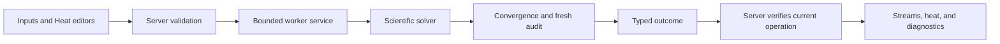

# CreateChemE code guide — main

**Branch:** `main`  
**Source snapshot:** `e8d8937eacc1d58692f1a4f289f0633ec25b4cd1`  
**Updated:** 2026-09-08

This is a progressive guide to the code at this snapshot. Read the first two levels for orientation, then expand the sections relevant to your work. The filename is retained from the earlier hybrid-solver branch guide; the content now describes `main`. Source links are relative to this file so they work in another checkout.

| Level | Question |
| --- | --- |
| [1. Overview](#level-1) | What does the application calculate? |
| [2. Code map](#level-2) | Where should I start reading? |
| [3. Game integration](#level-3) | What happens after Run, and which result is being shown? |
| [4. Scientific model](#level-4) | How are trays, hydrocarbon, water, and heat represented? |
| [5. Solver and acceptance](#level-5) | How does a starting guess become an accepted result? |
| [6. Working guide](#level-6) | Which files and tests help with a change? |
| [Glossary](#glossary) | What do the recurring terms mean? |

<a id="level-1"></a>

## Level 1 — Overview

CreateChemE is a Java 21 Minecraft 1.21.1 NeoForge addon for Create. Its calculator blocks accept a snapshot of operating conditions, calculate on a bounded CPU worker, and show streams, diagnostics, and energy information. They are the current experimental process-calculation interface; a connected, continuously operating plant is broader future work.

The game owns editing, requests, block state, and persistence. The scientific code accepts immutable Java data and calculates without Minecraft objects.



In text: edit → validate → admit → calculate → audit → commit → display.

| Calculation path | Entry point | Responsibility |
| --- | --- | --- |
| Older calculator / V1 | [ColumnSimulation][legacy-simulation] | Uses a counter-current equilibrium cascade and the older 12-cut property package. Column energy equations remain unsolved; it reports an approximate result. |
| Production V3 | [V3ColumnCalculator][calculator] | Coupled column material, equilibrium, and energy calculation, with liquid side draws, steam, optional free water on trays, and prescribed stage heat. Publishes only after its convergence and acceptance checks pass; advisories may accompany success. |
| Fixed Holland Example 3-2 | [V3HollandExample32][holland-facade] | Independent literature oracle, perturbed near-root V3 correction, and benchmark comparisons through the common solver/audit machinery. |

A fresh V3 block now starts on the **literature CDU** input using the reconstructed TJL19 package. The older Sotelo-derived pilot remains available in code and through the Tia Juana preset. Holland remains a locked benchmark preset.

[V3HybridPreconditioner][hybrid] still exists without a production caller. The active calculator uses sequential initialization and direct bubble-point projection, followed by simultaneous correction. Read actual call sites before assuming the class named “hybrid” controls the production path.

The main hand-offs are **input → resolved problem → seed → corrected state → audit → result**. A seed, an intermediate continuation solution, and a retained screen result each have different meanings; none alone proves that the current request succeeded.

<a id="level-2"></a>

## Level 2 — Code map

Production Java is under `src/main/java/com/wormzjl/createcheme/`. Most numerical helpers are package-private. Start with the public facade, then follow the helpers for the behavior you are investigating.

| Area | What it owns | Starting points |
| --- | --- | --- |
| Bootstrap and registry | Blocks, items, menus, common configuration, server lifecycle | [CreateChemE][bootstrap], [registry][registry] |
| Client screens | Inputs, Heat, Streams, Convergence; parsing and result provenance | [ColumnCalculatorV3Screen][screen], [V3ColumnInputDraft][input-draft], [V3ResultProvenance][result-provenance] |
| World adapters | Block/menu interaction, operation identity, saved input and display state | [ColumnCalculatorV3BlockEntity][block-entity], [ColumnCalculatorV3Menu][menu] |
| Network | Bounded codecs, server validation, preset requests, completion delivery | [ColumnV3Network][network], [ProcessSolveCoordinator][coordinator] |
| Runtime | Shared bounded workers, immutable commands, deadlines and cancellation | [ProcessSolveServices][services], [BoundedCpuSolveService][service] |
| V3 contracts | Input, topology, pressure/steam/heat profiles, equation inventory | [V3ColumnInput][input], [resolver][resolver], [V3ColumnProblem][problem], [ledger][ledger] |
| V3 correction | Seeds, feature ramps, residuals, Jacobians, Newton solve | [calculator][calculator], [initializer][initializer], [residual evaluator][residual], [simultaneous solver][solver] |
| Water and heat helpers | Wet trays, free-water continuation, thermal prediction and feasibility | [V3WetTraySet][wet-trays], [V3FreeWaterContinuation][water-continuation], [V3EnergyShiftPredictor][energy-shift], [V3HeatFeasibility][heat-feasibility] |
| Acceptance and output | Physical checks, streams, duties, display certificate | [auditor][auditor], [result][result], [stream builder][streams], [duty ledger][duty-ledger], [display][display] |
| `science/column/v3/thermo/` | PR78, packages, hydrocarbon flashes, separate pure-water correlations | [V3PengRobinsonThermo][thermo], [V3ThermoModel][thermo-api], [V3WaterProperties][water-properties] |
| `science/column/v3/linalg/` | Banded matrices and pivoted linear solution | [V3BandedPivotedSolver][linear] |
| Holland helpers | Fixture, special property model, independent oracle and facade | [fixture loader][holland-data], [HollandB12Thermo][holland-thermo], [oracle][holland-oracle], [facade][holland-facade] |
| Older science | Legacy column, equilibrium-stage calculation, general thermo foundation | [CounterCurrentColumnSolver][legacy-solver], [EquilibriumStageSolver][equilibrium-stage], [older thermo][legacy-thermo] |
| Equipment identities | Stable names for planned equipment types | [EquipmentType][equipment] |
| Verification | JUnit fixtures, Holland benchmark, cold-core benchmark tooling | [test tree][tests], [build.gradle][build], [scripts README][scripts] |

**Shortest reading path:** [input][input] → [calculator][calculator] → [problem][problem] → [residual][residual] → [solver][solver] → [auditor][auditor]. For screen work, start at [screen][screen] and [block entity][block-entity].

Some class names and comments still say “dry” even though the implementation now carries water. The current fields, equation families, and call sites are the authority for this guide.

<a id="level-3"></a>

## Level 3 — Game integration

<details>
<summary>Expand: requests, presets, configuration, Heat page, and persistence</summary>

### One calculation request

| Step | Code | Behavior |
| --- | --- | --- |
| Edit | [screen][screen] and draft helpers | Convert display units into SI, preserve authored lists, and report validation errors. Inputs and Heat contribute to the same request. |
| Validate | [ColumnV3Network][network] | Verify player/menu/block context, package/basis, schema, and resolved-input constraints. Holland must match its fixed server input. |
| Begin | `ColumnCalculatorV3BlockEntity.tryBegin` | Reject stale input revisions or an active operation; otherwise freeze an immutable operation. |
| Admit | `ProcessSolveServices.submitV3Column` | Capture both trace cutoff and convergence closure, convert percentages to fractions, and enqueue the command. |
| Calculate | `V3ColumnCommand.solve` | Route Holland to its special facade; route ordinary input to `V3ColumnCalculator.calculate(input, control, cutoff, closure)`. |
| Drain and commit | [coordinator][coordinator] and network completion handler | Drain on the server thread, verify operation identity, update block state, and notify viewers. |

A worker's normal completion can contain a scientific `Failure`. The network checks both service status and `V3ColumnOutcome`. Missing/replaced blocks or mismatched operations make the result stale.

Minecraft objects and delivery metadata stay on the server thread. Workers receive immutable commands. One service per logical server serves V1 and V3, with bounded admission, one outstanding job per owner, cooperative cancellation, and bounded shutdown.

### Configuration captured for each request

The common file is `createcheme-common.toml`; definitions are in [CreateChemE][bootstrap].

| Setting | Default | Meaning |
| --- | --- | --- |
| `solver.workers` | 1 | Platform CPU workers; allowed range 1–2. |
| `solver.readyQueueCapacity` | 8 | Admitted jobs waiting for a worker. |
| `solver.deadlineMilliseconds` | 45,000 | Cooperative deadline, starting at admission, including queue time. |
| `solver.gracefulShutdownMilliseconds` | 1,000 | Grace period before worker interruption. |
| `solver.forcedShutdownMilliseconds` | 1,000 | Bounded wait after interruption. |
| `columnV3.stageTraceCutoffMolPercent` | 0 | Optional stage/flash cutoff, allowed 0–1 mol%. The numerical trace floor still operates at zero. |
| `columnV3.columnV3ConvergenceClosurePercent` | 0 | Zero selects `1e-8`; allowed authored range 0–0.1%. Captured independently of cutoff. |

Configuration reloads do not change an in-flight command. Holland uses its own fixed benchmark tolerances. A cooperative deadline is checked at explicit checkpoints, so interruption is not instantaneous inside every operation.

### Presets and fresh blocks

[The block entity][block-entity] provides three useful entry points:

- `freshInput()` calls `literatureCduInput()`: the 40-tray TJL19 reconstruction described in level 4.
- `pilotPresetInput()` returns the older 29-tray, dry Sotelo-derived qualification draft.
- `V3HollandExample32.input()` builds the fixed Holland benchmark.

The screen's preset button switches between Holland and the Tia Juana pilot. `handlePreset` builds the preset on the server, validates current revision and idle state, and clears the old display certificate. Holland editors are locked. Draft heat rows have explicit preservation logic for resize/preset round trips; the draft parser still assembles and validates the eventual request.

### Heat and retained results

The screen has **Inputs, Streams, Heat, and Convergence** pages. [V3PumparoundDraft][heat-draft] parses signed duties and placement rules; [V3SteamFeedDraft][steam-draft] parses steam rows; [V3ColumnInputDraft][input-draft] assembles the full immutable input without losing authored heat during edits on another page.

The Heat page displays prescribed stage duties and the accepted [V3ColumnDutyLedger][duty-ledger]. Positive duty adds heat; cooling is negative. The ledger contains calculated condenser duty, specified reboiler duty, stage-heat total, up to 16 nonzero per-tray detail rows, and feed/steam enthalpy rates. The total covers all trays even when detail rows are capped.

The block retains the last accepted display during a new calculation, after failure, and across reload. [V3ResultProvenance][result-provenance] marks it **“Input edited since run”** or **“Retained result from an earlier run”** when appropriate. Only `SUCCESS`, a present result, and an unedited draft mean the certificate matches the displayed input. Input and result revisions are independent counters and must not be compared numerically to infer a match. Retained ledger values must not label the current cooler draft as accepted.

### Persistence and wire contracts

Current versions are scientific input schema **1**, wire schema **8**, and block data version **8**. Input lists now include side draws, steam feeds, and pumparounds. The bounded display includes up to **7 streams**, an optional duty ledger, and the recorded convergence closure. Older saves can lack those additions; load paths apply explicit defaults and compatibility handling.

Saved display state excludes mutable solver workspaces and stage profiles. A persisted result is presentation data, not a warm-start solution. Continuation state lives only within one calculation.

</details>

<a id="level-4"></a>

## Level 4 — Scientific model

<details>
<summary>Expand: input units, trays, water, heat, property packages, and literature cases</summary>

### Authored input and units

[V3ColumnInput][input] carries package/assay identifiers, a public hydrocarbon component order, feed component rates, feed temperature, geometry, pressures, three base specifications, and bounded feature lists. Arrays are copied defensively and lists are canonicalized. [The resolver][resolver] checks geometry, feature placement, physical input restrictions, and equation closure.

| Input | Unit / rule |
| --- | --- |
| Hydrocarbon component feed | mol/s, not a fraction vector |
| Temperature | K |
| Pressure | Pa, absolute |
| Heat duty | W; positive into the column |
| Molar enthalpy | J/mol |
| Reflux | `L/D`: reflux divided by external organic liquid distillate |
| Base specifications | Condenser outlet temperature, reflux ratio, reboiler duty |
| Liquid side draws | At most 3; one positive total molar rate per equilibrium tray; combined rate below hydrocarbon feed |
| Steam feeds | At most 2; positive rate and temperature, one per injection stage; sump is `N+1` |
| Pumparounds / stage heat | At most 3 authored zones, unique return/draw pairs; finite nonzero signed duty |

Steam must be at least 5 K superheated at injection pressure, within the water-property temperature envelope, and its total molar rate must not exceed hydrocarbon feed. A steam-bearing input with zero reboiler duty requires sump steam. Condenser temperature must stay above the ice-free lower bound.

### Tray indexing and stored flows

```text
0       condenser: specified temperature
1..N    equilibrium trays: liquid moves down, vapor moves up
f       hydrocarbon feed tray, 1 <= f <= N
N+1     reboiler / sump: steam may be injected here
```

There are `N+2` physical nodes. Condenser and top tray use top pressure; tray `j` uses `P_top + (j-1)*pressureDrop`; sump pressure equals bottom-tray pressure.

[V3DryMeshState][state] stores hydrocarbon liquid/vapor component rates, temperatures, and a free-water profile. Hydrocarbon phase totals and compositions are derived from component rates. The external [component basis][basis] keeps a stable ordering; [active basis][active-basis] removes exact-zero hydrocarbon feed components from numerical coordinates.

For a side draw of rate `S` on a tray with stored organic liquid total `L`, the state holds the liquid **before withdrawal**. The draw takes fraction `S/L`; liquid passing downward carries the remaining fraction. [V3SideDraws][side-draws] shares the arithmetic across equations, audits, and stream reporting. Acceptance requires `L > S`. Free water is immiscible and is not withdrawn with organic side products.

### Prescribed stage heat

[V3PumparoundSpec][pumparound] describes a return tray, draw tray, signed duty, and split. `RETURN_TRAY` places all duty on the return tray; `UNIFORM` divides it over the inclusive zone. [V3Pumparounds][pumparounds] compiles the node heat profile.

This implementation models the heat effect. It does not add a circulating liquid stream, pump flow, or a specified return temperature. The feature changes stage energy equations without introducing a new circulation unknown. Boundary nodes are excluded because condenser and reboiler have separate contracts.

### Water is separate from the hydrocarbon EOS axis

[V3SteamFeeds][steam-feeds] forms the authored upward steam profile. [V3ColumnProblem][problem] computes water vapor from that profile and adjacent free-water flow. Hydrocarbon fugacity evaluation still uses normalized hydrocarbon compositions; vapor dilution by water adds a separate logarithmic correction. Energy accounts for vapor water, injected steam enthalpy, and aqueous liquid transport.

The hydrocarbon condenser branch (`TWO_PHASE` or `LIQUID_ONLY` on the production route) and [water condenser regime][water-regime] are separate decisions: `NONE`, `FREE_WATER`, or `ALL_VAPOR`. Water can leave as overhead vapor/slip or a separate free-water product. An organic liquid-only condenser can still have a pure-water vapor outlet.

[V3WetTraySet][wet-trays] determines which equilibrium trays carry free aqueous liquid. Each solved wet tray adds one positive free-water-flow unknown and one saturation equation. Free water falls to the next tray and can re-evaporate there. With a dry sump, the telescoped balance is:

```text
water vapor at node n = steam injected at or below n + free water from tray n-1
```

This local coupling preserves the banded Jacobian. The sump never gains a free-water unknown in the current formulation: its liquid water would couple to every node above. The condenser has its own decant calculation.

A dry stage below its water dew point can now pass the audit **with a warning**. That result does not certify equilibrium condensation on the dry stage. A declared wet tray must carry free water and satisfy its saturation relation; failures there remain fatal and take priority over dry-stage warnings. This distinction is encoded in `V3AcceptanceAuditor.waterDewPoint`.

### Equations and coordinates

[The degree-of-freedom ledger][ledger] enumerates unknowns and residual rows, checks counts and structural rank, and supplies their stable ordering. [The coordinate map][coordinates] uses logarithmic positive-flow coordinates and temperatures in kelvin. Absent support entries have exact zero flow and no corresponding coordinate.

[The residual evaluator][residual] assembles:

- Component material balances, including organic withdrawal and reflux.
- Hydrocarbon vapor–liquid equilibrium, with water dilution where needed.
- Tray/sump energy balances, including authored stage heat, steam, and free-water transport.
- Water saturation rows on solved wet trays.

MESH means material, equilibrium, summation, and heat balance. Summation is implicit through normalized phase compositions. The condenser temperature is specified, so it has no temperature unknown or MESH energy row; its duty is calculated afterward.

For a dry, full-support tray with `C` active hydrocarbons, there are `2C+1` unknowns and equations. A two-phase condenser has `2C`; a liquid-only condenser has `C`. Wet trays and per-phase support alter these counts, so code must use the ledger rather than a fixed formula.

Material residuals are now scaled against local component throughput, bounded above by component flow scale and below by `flowScale * 1e-10`. Energy and equilibrium have their own scales. This differs from the older guide's feed-only material normalization.

### Property packages and current presets

[V3ThermoModel][thermo-api] is the numerical property boundary. Production [V3PengRobinsonThermo][thermo] uses its [session][session], [PR78 kernel][kernel], and caller-owned [workspace][workspace]. [V3FeedFlash][feed-flash] resolves hydrocarbon TP splits; [V3TruncatedFlash][truncated-flash] provides optional reference-validated phase approximation. The older `science/thermo` implementation remains separate.

| Registered production package | Contents / provenance |
| --- | --- |
| `createcheme:cdu17_tjl_acs2018` | [Original CDU package][package]: 16 dry public entries despite its historical name; methane, ethane, propane, C4 lump and PC01–PC12. Default assay has zero methane. |
| `createcheme:tjl19_dwsim` | [TJL19 package][tjl19]: 19 hydrocarbon entries reconstructed with DWSIM 10.2.3, with polynomial heat-capacity fits and analytic enthalpy. Dataset `tjl19-dwsim-10.2.3-r1`. |

The registry contains compiled packages. Original CDU provenance notes are in the [.properties resource][provenance]. TJL19 explicitly records reconstructed rather than original HYSYS properties, extrapolated heavy fractions, thermal-fit limits, and a PR78 coefficient difference. The declared 298.15–900 K and 50–2,000 kPa property bounds do not establish universal convergence.

[V3WaterProperties][water-properties] supplies separate pinned saturation and caloric correlations with revision `water-iapws-shomate-r1`; water is not inserted into either hydrocarbon package axis.

The fresh-block literature input is built by `literatureCduInput()`:

| Quantity | Authored value |
| --- | --- |
| Package / hydrocarbon feed | TJL19, about 737.6996333 mol/s |
| Geometry / feed | 40 trays, feed on 37 at 365 °C |
| Pressure | 250 kPa absolute, zero tray drop |
| Condenser / reflux / reboiler | 59 °C, 4.17, 0 W |
| Organic draws | Trays 10/18/28 at 491/515/165 kmol/h |
| Steam | Sump node 41, 1,200 kmol/h at 260 °C |
| Cooling | Uniform zones 8–10, 16–18, 26–28 at −12.84/−17.89/−11.20 MW |

This reconstructs the Ledezma-Martinez (2019) no-preflash case through the current model. It omits source side-stripper reboiler heat and explicit circulating pumparounds. The source comment documents a cooler top tray and a water-dew warning with the published top-cooler duty. Consult the current outcome and advisories rather than treating “literature” as a guarantee of matching every published state.

The older pilot remains 29 trays, feed stage 24, 2,610.7 kmol/h at 365 °C, 150 kPa top pressure with 750 Pa/tray drop, 400 K condenser, reflux 2 and 8 MW reboiler. Its Sotelo-derived draw rates are 92.30/131.85/32.96 kmol/h on trays 13/17/22. Those are scaled source volume proportions applied to the pilot feed.

### Holland benchmark

[The Holland facade][holland-facade] validates exact equality to its fixed input, runs [independently assembled equations][holland-oracle], perturbs their solved state, and corrects it with the ordinary V3 solver. [HollandB12Thermo][holland-thermo] uses the book's correlations from [the fixture][holland-fixture], not the production PR registry.

The fixed input has 11 trays and 11 components, feed tray 4, a 25 lb-mol/h organic draw on tray 9, and 300 psia pressure. It uses a large organic reflux/distillate split ratio to express the example through V3's condenser contract. Acceptance combines the common audit with oracle agreement and selected printed-temperature/duty comparisons. Known conflicting printed numbers remain advisory; the benchmark does not assert a strict pass against the entire inconsistent printed table or qualify the general production cold start.

</details>

<a id="level-5"></a>

## Level 5 — Solver and acceptance

<details>
<summary>Expand: continuation, numerical support, wet-tray solution, closure, and diagnostics</summary>

### The orchestration layer

[V3ColumnCalculator][calculator] owns admission, seed problems, continuation, retries, phase changes, support refresh, and publication. Its `Dwsim` method names refer to local numerical approaches; no external simulator is invoked during a production solve.

| Method / helper | Responsibility |
| --- | --- |
| `calculate`, `calculateBranch` | Validate input/policy, choose branch and continuation, return typed outcome. |
| `staticCoolingAdmission`, [V3HeatFeasibility][heat-feasibility] | Reject cooling beyond necessary energy bounds with `INFEASIBLE_SPECIFICATION`. |
| `solveDwsimStageContinuation` | Increase tray count on a simpler problem. |
| `solveDwsimPressureContinuation` | Continue a 150 kPa anchor toward an admitted low-pressure request. |
| `recoverWithDrawRamp`, `rampSteps`, `heatBearingRampSteps` | Introduce steam, heat, and draws at full geometry. |
| `solveSingleProblem` | Flash feed, prepare support/wet set, run Newton and audit, and manage bounded refreshes. |
| `correctCondenserPhase` | Prepare a warm branch correction when the condenser phase check is the remaining obstacle. |
| `prepareAttempt`, `refreshFloorSupport` | Keep the problem, support, wet set and seed consistent. |
| `publishesSuccess` | Check converged attempt, final-step certificate, and accepted audit. |

### Initialization and feature ramps

[V3ColumnInitializer][initializer] builds material-closed flow estimates and bounded sequential material/VLE refinements. [V3BubblePointPreconditioner][bubble] supplies direct projections for continuation and recovery. A prepared seed is optional numerical assistance and cannot publish itself.

The unwired [hybrid selector][hybrid] chooses bubble-point then sum-rates for ordinary volatility, or sum-rates alone when `max(ln K)-min(ln K) > ln(10,000)`. [Sum-rates][sum-rates] is an internal strategy, not the production dispatcher; applicability checks restrict unsupported feature combinations.

Tray grids include applicable values from 4, 8, 15, then 30 and successive doublings below the requested size, then that size. A 40-tray request uses `4 → 8 → 15 → 30 → 40`. Feed position is mapped proportionally. Feature-bearing requests first construct a dry seed with draws and stage heat removed; steam's boilup contribution is temporarily represented by surrogate reboiler duty.

At full geometry, the feature ramp restores the authored problem. Without stage heat, steam precedes draws when both exist. With heat, the order is **steam → heat → draws**. Steam uses 4–24 bounded increments based on total rate; heat starts with four increments; heat-bearing draws use eight rather than the four used by the simpler draw ramp. Heat increments can be subdivided within explicit global/per-rung budgets. Final publication requires the authored endpoint, not a reduced-rate candidate.

For top pressure at or below 100 kPa, the pressure path starts at 150 kPa. Simple dry requests use 10 kPa steps above 110 kPa and 5 kPa below; feature cases use finer 5 kPa steps. Steam/heat cases continue the simplified surrogate to requested pressure before restoring features. Read the selected solve path and events to distinguish a failed anchor, intermediate rung, and authored endpoint.

[V3HeatFeasibility][heat-feasibility] checks the available feed/reboiler/steam energy and the base condenser-duty bound. Both credit positive authored stage heating, so cooling paired with heating is not assessed as cooling alone. It also estimates local incoming-vapor condensation capacity when limiting heat increments. These are necessary checks, not guarantees of a solution.

[V3EnergyShiftPredictor][energy-shift] improves a heat/steam handoff by solving a temperature-only tridiagonal energy correction at fixed flows. One prediction is bounded to 40 K per tray. Its result remains a seed for full correction and audit.

### Newton and linear algebra

[V3SimultaneousColumnSolver][solver] evaluates residuals, obtains a direction, and uses an admissible Armijo line search to reduce the squared scaled residual. It may use a local block predictor, full finite differences, limited reuse, or damped normal-equation/gradient fallback directions.

[The stage layout][layout] follows the ledger, including variable support and wet-tray rows. [Local Jacobian assembly][block-jacobian] combines exact material derivatives with local thermodynamic probes; [full finite differences][jacobian] provide the comparison/fallback path with stage coloring for sufficiently large systems. [The banded solver][linear] equilibrates rows before pivoting and reports linear numerical evidence. Off-band guards detect unintended coupling.

A local/reused/fallback direction does not automatically establish the final Newton certificate. The solver verifies the final correction as required before returning `Attempt.Converged`.

### Numerical trace floor and optional cutoff

[V3TruncationSupport][support] now records each component/node as `BOTH`, `LIQUID_ONLY`, `VAPOR_ONLY`, or `ABSENT`.

| Support | Unknowns and conservation |
| --- | --- |
| Both phases | Both component-flow coordinates plus material and equilibrium rows. |
| One phase | One flow coordinate and material row; no equilibrium row for that component. Material remains in the retained phase. |
| Absent | No flow coordinates or material/equilibrium rows; incoming material becomes an audited sink defect. |

An **always-on relative floor** of `1e-10 * componentFlowScale` removes numerically negligible flows even when the authored cutoff is zero. Zero disables the optional mol% cutoff and flash approximation; it no longer means every positive phase flow remains an independent unknown.

Support is fixed during each Newton solve. Between solves, the calculator may remove or reinsert phases using current inflows and equilibrium estimates from [V3StageEquilibriumRatios][stage-ratios]. Reinsertion uses hysteresis of ten floors. Up to three floor refreshes are allowed, including at most one after a stalled attempt; a stalled refresh that only removes support has a shorter 16-iteration polish budget.

The earlier forced feed-to-draw support band has been retired. Intermediate trays are decided from their flows, while a draw tray preserves liquid supplied from above. Do not carry the old “all active components are retained along the entire product path” assumption into this implementation.

Acceptance distinguishes `TRUNCATION_MASS_DEFECT` for sink losses from `PHASE_TRUNCATION_DEFECT` for the equilibrium estimate of an omitted phase. The mass budget includes both optional-cutoff and numerical-floor allowances. One-phase reduction is not a license to ignore a phase whose equilibrium amount is significant.

With a positive optional cutoff, [V3TruncatedFlash][truncated-flash] first obtains an unrestricted hydrocarbon flash reference, tries phase-specific reduction, and checks the candidate against the reference. Feed energy still uses reference enthalpy. [V3TruncationFallback][truncation-fallback] can retry an eligible failed chain with the optional cutoff disabled; the always-on floor remains. Admission failures and cancellation do not become approximate success.

### Wet trays and free-water continuation

The wet-tray set is frozen during Newton and re-evaluated only after a converged attempt, with a separate budget of three wet-set refreshes. Wet entry/exit hysteresis avoids repeatedly toggling nearly dry trays.

When direct simultaneous wet correction is difficult, [V3FreeWaterContinuation][water-continuation] temporarily holds free-water rates as parameters. It solves the remaining column equations and searches for rates that close water saturation, sweeping top to bottom. The bounded search permits four sweeps, up to twelve parametric solves per tray, and up to six newly admitted trays. It then restores free-water unknowns and saturation rows for a certifying simultaneous solve. Parametric states are never published directly.

If the free-water continuation cannot produce a realizable wet state, an otherwise converged dry candidate can survive with the named dew-point advisory. A modeled wet tray with missing water or incorrect saturation still fails. Read the event explaining why a wet set was accepted or declined.

### Closure policy and acceptance

The ordinary facade accepts both optional cutoff and convergence closure. Zero authored closure selects `1e-8`; positive input is bounded by `1e-3`, with effective closure no tighter than `1e-8`. The effective value travels with convergence evidence and display provenance.

| Gate | Current rule |
| --- | --- |
| Scaled residual | Must meet the selected closure. |
| Final log-flow change | Must meet the certificate's closure. |
| Linear backward error | At most `1e-12`; unaffected by closure setting. |
| Temperature change | Per-coordinate `1e-6 K + 1e-9*T`; unaffected by closure setting. |
| Physical audit | Fresh checks at the matching closure; equilibrium, condenser split and energy closure limits follow policy. |

[The auditor][auditor] recomputes finite topology, side-draw feasibility, material/equilibrium/energy errors, support defects, and condenser phase. Wet columns additionally check water profile, water balance, dew-point/saturation behavior and applicable free-water split. Steam or stage heat enables a whole-column boundary energy check; wet columns also verify condenser energy closure.

These boundary energy checks matter because the condenser duty is calculated rather than solved as an unknown. They independently account for water outlets and signed stage heat so a consistent-looking residual alone cannot hide an incorrect output duty.

A success can include scientific advisories. In particular, `waterDewPoint` prioritizes an invalid modeled wet tray over a larger dry-tray supersaturation warning. This is part of the current acceptance contract, not an instruction to discard diagnostics once the status says success.

### Revisions and output provenance

Use `formulationRevision(input, cutoff, closure)` rather than the single `FORMULATION_REVISION` constant to identify a result.

| Family | Current base label |
| --- | --- |
| Dry, no draws or heat | `v3-dry-mesh-r23`; positive cutoff selects `v3-dry-mesh-r24-flash-trace` |
| Dry with side draws | `v3-dry-mesh-r25-side-draws` |
| Dry with side draws and heat | `v3-dry-mesh-r26-side-draws` plus `-stage-heat` |
| Dry heat without draws | `v3-dry-mesh-r27` plus `-stage-heat` |
| Steam without heat | `v3-wet-mesh-r30-steam` |
| Steam with heat | `v3-wet-mesh-r31-steam` plus `-stage-heat` |

Relevant labels also add `-side-draws`, `-flash-trace`, and a canonical `-closureMeN` suffix as implemented. Assumptions use `v3-dry-assumptions-r4` or `v3-wet-assumptions-r2`, adding `+v3-heat-assumptions-r1` for stage heat. [V3InputDigest][digest] records scientific identity and policy. Holland maintains its separate benchmark labels.

Successful outputs are built from the accepted state. They include hydrocarbon products and water where applicable, optional duties, and the actual closure. No numerical state is retained for the next player request.

</details>

<a id="level-6"></a>

## Level 6 — Working guide

<details>
<summary>Expand: tests, debugging, and change entry points</summary>

### Running existing checks

From the repository root in PowerShell:

```powershell
# Full existing suite
.\gradlew.bat test

# Steam, free-water, stage-heat, closure and provenance checks
.\gradlew.bat test --tests '*V3FreeWaterTrayTest' --tests '*V3PumparoundContractTest' --tests '*V3ConvergenceClosureTest' --tests '*V3ResultProvenanceTest'

# Current fresh-block literature input
.\gradlew.bat test --tests '*V3LiteraturePresetTest'

# Fixed Holland benchmark and its report
.\gradlew.bat v3HollandBenchmark

# Interactive development client
.\gradlew.bat runClient
```

Use `./gradlew` on a POSIX shell. Numerical continuation tests can be substantial; use the relevant fixture while investigating one layer. These commands are navigation instructions, not a record of a new full-suite run.

The Holland task writes `build/reports/benchmarks/v3-holland-example-3-2.json` by default. The tracked [scripts README][scripts] explains the cold-core benchmark supervisor, isolated timing, frozen classpaths and manifests, and report analysis. Its example depends on saved run artifacts; prepare or locate those before replaying it. Some older Gradle diagnostic tasks still refer to ignored local `benchmarks/` harnesses, so a task declaration alone does not establish clean-checkout availability.

### Tests as executable documentation

All of these classes are under [the test tree][tests].

| Topic | Tests to read |
| --- | --- |
| Input, topology, ledger | `V3ColumnInputTest`, `V3DegreeOfFreedomLedgerTest`, `V3ActiveComponentBasisTest` |
| Residuals and derivatives | `V3MeshResidualEvaluatorTest`, `V3FiniteDifferenceJacobianTest`, `V3BlockJacobianAssemblerTest` |
| Numerical support | `V3TraceFloorSupportTest`, `V3PhaseTruncationTest`, `V3TruncationAuditTest`, `V3TruncationFallbackTest` |
| Water contract and solution | `V3SteamFeedContractTest`, `V3FreeWaterTrayTest` |
| Heat contract and combined features | `V3PumparoundContractTest`, `V3PumparoundCalculatorTest`, `V3PumparoundSteamCalculatorTest`, `V3EnergyShiftPredictorTest` |
| Closure and output | `V3ConvergenceClosureTest`, `V3ColumnDisplayResultTest` |
| Fresh literature default | `V3LiteraturePresetTest` |
| Screen parsing/provenance | `V3ColumnInputDraftTest`, `V3ColumnScalarDraftTest`, `V3PumparoundDraftTest`, `V3SteamFeedDraftTest`, `V3ResultProvenanceTest` |
| Serialization | `V3PumparoundCodecTest`, `V3SideDrawCodecTest` |
| Runtime | `BoundedCpuSolveServiceTest`, `ProcessSolveServicesRequestTest`, `V3ColumnCommandTest` |
| Independent comparisons | `IndependentIdealMeshOracleTest`, `HollandExample32BenchmarkTest` |

A fixture passing for one input is evidence for that input and its asserted behavior. Broader performance and operating-domain claims need the benchmark manifests and corresponding reports.

### Debug from the visible outcome inward

1. Check result provenance first: a Heat ledger or stream table can belong to an earlier accepted run.
2. Distinguish admission/busy/deadline failure from a scientific failure or accepted warning.
3. Inspect exact input, package, pressure convention, feature lists, cutoff, and effective closure.
4. Read solve-path and ramp events to identify the geometry, pressure, steam/heat/draw fraction and whether the authored endpoint was reached.
5. Inspect the dominant equation, local material scale, wet-set and support events, then failed audit families.
6. For `WATER_DEW_POINT`, distinguish a dry-stage warning from an invalid modeled wet tray. For heat rejection, inspect the credited heating and the specific cooling bound.
7. Reproduce through the matching facade with a bounded control. Holland input goes through its fixed benchmark facade; production input goes through `V3ColumnCalculator`.

Diagnostics are bounded summaries. The selected attempt's Newton iteration count is not automatically total work across all continuation and support-refresh solves. Use trace callbacks or benchmark reports for complete cost analysis.

### Change the layer that owns the behavior

| Change | Start with | Preserve |
| --- | --- | --- |
| Draft editing / Heat UI | [screen][screen], [input draft][input-draft], individual parsers, [provenance helper][result-provenance] | SI conversion, signed duties, complete feature lists, retained-result labeling. |
| Presets / saved state | [block entity][block-entity], [network][network] | Server ownership, migrations, bounded codecs, current-operation identity. |
| New equation or feature | [input][input], [resolver][resolver], [ledger][ledger], [residual][residual] | Equation/unknown closure, locality, initializer, Jacobian and independent audit. |
| Continuation / support | [calculator][calculator], [support][support], [wet set][wet-trays], [energy predictor][energy-shift] | Fixed support per Newton solve, bounded retries, authored endpoint, physical audit. |
| Thermodynamic changes | [packages][package-registry], [PR facade][thermo], [water properties][water-properties] | Public axes, units, package bounds, fit provenance, revision identity. |
| Acceptance / closure | [auditor][auditor], [convergence evidence][convergence], [digest][digest] | Matching policy throughout solve, audit and published certificate; warning/failure distinction. |
| Output energy | [duty ledger][duty-ledger], [streams][streams], [display][display] | Boundary energy accounting, water outlets, optional legacy ledger, serialization. |

This September 8 update was checked against `main` source and local link/test references. The earlier September 1 benchmark runs apply to their recorded older commit and are not current-main verification. No solver suite was rerun solely to edit this guide.

The `documentation/` folder remains ignored by Git. Research/action plans and archived experiments elsewhere in it retain their own historical status; this guide describes the source snapshot named at the top. In particular, earlier claims that there is no support-refresh mechanism are obsolete on current `main`.

</details>

<a id="glossary"></a>

## Glossary

<details>
<summary>Expand: recurring terms</summary>

| Term | Meaning here |
| --- | --- |
| Assay / pseudocomponent | Crude composition description / a modeled petroleum fraction. |
| TP flash | Phase split at specified temperature and pressure. |
| PR78 / EOS | Peng–Robinson 1978 / equation of state. |
| VLE / K-value | Vapor–liquid equilibrium / equilibrium vapor-to-liquid composition ratio. |
| MESH | Material, equilibrium, summation, and heat equations. |
| DOF ledger | Inventory and connectivity of unknowns, equations and specifications. |
| Seed / continuation | Starting estimate / solving related intermediate problems to approach the request. |
| Residual / Jacobian | Equation error / its sensitivity to all numerical unknowns. |
| Armijo search | Shortening a direction until the chosen error measure decreases sufficiently. |
| Support | Which component phases exist as numerical unknowns at each node. |
| Trace floor / optional cutoff | Always-on numerical support threshold / authored approximation setting. |
| Wet tray | A tray carrying modeled immiscible free water with a saturation equation. |
| Parametric water solve | Temporary solve with free-water rates held fixed while finding rates for certification. |
| Stage heat | A signed energy input distributed over authored trays. |
| Closure | Selected residual/final-flow accuracy, carried into the certificate and audit policy. |
| Accepted advisory | A reported limitation or operating warning that accompanies a passing result. |
| Retained result | Earlier accepted presentation state that may not match the current input. |

</details>

[legacy-simulation]: ../src/main/java/com/wormzjl/createcheme/science/column/ColumnSimulation.java
[calculator]: ../src/main/java/com/wormzjl/createcheme/science/column/v3/V3ColumnCalculator.java
[holland-facade]: ../src/main/java/com/wormzjl/createcheme/science/column/v3/V3HollandExample32.java
[hybrid]: ../src/main/java/com/wormzjl/createcheme/science/column/v3/V3HybridPreconditioner.java
[bootstrap]: ../src/main/java/com/wormzjl/createcheme/CreateChemE.java
[registry]: ../src/main/java/com/wormzjl/createcheme/registry/
[screen]: ../src/main/java/com/wormzjl/createcheme/client/gui/screens/inventory/ColumnCalculatorV3Screen.java
[input-draft]: ../src/main/java/com/wormzjl/createcheme/client/gui/screens/inventory/V3ColumnInputDraft.java
[result-provenance]: ../src/main/java/com/wormzjl/createcheme/client/gui/screens/inventory/V3ResultProvenance.java
[block-entity]: ../src/main/java/com/wormzjl/createcheme/world/level/block/entity/ColumnCalculatorV3BlockEntity.java
[menu]: ../src/main/java/com/wormzjl/createcheme/world/inventory/ColumnCalculatorV3Menu.java
[network]: ../src/main/java/com/wormzjl/createcheme/network/ColumnV3Network.java
[coordinator]: ../src/main/java/com/wormzjl/createcheme/network/ProcessSolveCoordinator.java
[services]: ../src/main/java/com/wormzjl/createcheme/runtime/ProcessSolveServices.java
[service]: ../src/main/java/com/wormzjl/createcheme/runtime/BoundedCpuSolveService.java
[input]: ../src/main/java/com/wormzjl/createcheme/science/column/v3/V3ColumnInput.java
[resolver]: ../src/main/java/com/wormzjl/createcheme/science/column/v3/V3ColumnProblemResolver.java
[problem]: ../src/main/java/com/wormzjl/createcheme/science/column/v3/V3ColumnProblem.java
[ledger]: ../src/main/java/com/wormzjl/createcheme/science/column/v3/V3DegreeOfFreedomLedger.java
[initializer]: ../src/main/java/com/wormzjl/createcheme/science/column/v3/V3ColumnInitializer.java
[residual]: ../src/main/java/com/wormzjl/createcheme/science/column/v3/V3MeshResidualEvaluator.java
[solver]: ../src/main/java/com/wormzjl/createcheme/science/column/v3/V3SimultaneousColumnSolver.java
[wet-trays]: ../src/main/java/com/wormzjl/createcheme/science/column/v3/V3WetTraySet.java
[water-continuation]: ../src/main/java/com/wormzjl/createcheme/science/column/v3/V3FreeWaterContinuation.java
[energy-shift]: ../src/main/java/com/wormzjl/createcheme/science/column/v3/V3EnergyShiftPredictor.java
[heat-feasibility]: ../src/main/java/com/wormzjl/createcheme/science/column/v3/V3HeatFeasibility.java
[auditor]: ../src/main/java/com/wormzjl/createcheme/science/column/v3/V3AcceptanceAuditor.java
[result]: ../src/main/java/com/wormzjl/createcheme/science/column/v3/V3ColumnResult.java
[streams]: ../src/main/java/com/wormzjl/createcheme/science/column/v3/V3ColumnStreamProperties.java
[duty-ledger]: ../src/main/java/com/wormzjl/createcheme/science/column/v3/V3ColumnDutyLedger.java
[display]: ../src/main/java/com/wormzjl/createcheme/science/column/v3/V3ColumnDisplayResult.java
[thermo]: ../src/main/java/com/wormzjl/createcheme/science/column/v3/thermo/V3PengRobinsonThermo.java
[thermo-api]: ../src/main/java/com/wormzjl/createcheme/science/column/v3/thermo/V3ThermoModel.java
[water-properties]: ../src/main/java/com/wormzjl/createcheme/science/column/v3/thermo/V3WaterProperties.java
[linear]: ../src/main/java/com/wormzjl/createcheme/science/column/v3/linalg/V3BandedPivotedSolver.java
[holland-data]: ../src/main/java/com/wormzjl/createcheme/science/column/v3/HollandExample32Data.java
[holland-thermo]: ../src/main/java/com/wormzjl/createcheme/science/column/v3/HollandB12Thermo.java
[holland-oracle]: ../src/main/java/com/wormzjl/createcheme/science/column/v3/IndependentHollandMeshOracle.java
[legacy-solver]: ../src/main/java/com/wormzjl/createcheme/science/column/CounterCurrentColumnSolver.java
[equilibrium-stage]: ../src/main/java/com/wormzjl/createcheme/science/column/EquilibriumStageSolver.java
[legacy-thermo]: ../src/main/java/com/wormzjl/createcheme/science/thermo/
[equipment]: ../src/main/java/com/wormzjl/createcheme/science/equipment/EquipmentType.java
[tests]: ../src/test/java/com/wormzjl/createcheme/
[build]: ../build.gradle
[scripts]: ../scripts/README.md
[heat-draft]: ../src/main/java/com/wormzjl/createcheme/client/gui/screens/inventory/V3PumparoundDraft.java
[steam-draft]: ../src/main/java/com/wormzjl/createcheme/client/gui/screens/inventory/V3SteamFeedDraft.java
[state]: ../src/main/java/com/wormzjl/createcheme/science/column/v3/V3DryMeshState.java
[basis]: ../src/main/java/com/wormzjl/createcheme/science/column/v3/V3ComponentBasis.java
[active-basis]: ../src/main/java/com/wormzjl/createcheme/science/column/v3/V3ActiveComponentBasis.java
[side-draws]: ../src/main/java/com/wormzjl/createcheme/science/column/v3/V3SideDraws.java
[pumparound]: ../src/main/java/com/wormzjl/createcheme/science/column/v3/V3PumparoundSpec.java
[pumparounds]: ../src/main/java/com/wormzjl/createcheme/science/column/v3/V3Pumparounds.java
[steam-feeds]: ../src/main/java/com/wormzjl/createcheme/science/column/v3/V3SteamFeeds.java
[water-regime]: ../src/main/java/com/wormzjl/createcheme/science/column/v3/V3WaterCondenserRegime.java
[coordinates]: ../src/main/java/com/wormzjl/createcheme/science/column/v3/V3DryMeshCoordinateMap.java
[session]: ../src/main/java/com/wormzjl/createcheme/science/column/v3/thermo/V3PengRobinsonSession.java
[kernel]: ../src/main/java/com/wormzjl/createcheme/science/column/v3/thermo/V3PengRobinsonKernel.java
[workspace]: ../src/main/java/com/wormzjl/createcheme/science/column/v3/thermo/V3ThermoWorkspace.java
[feed-flash]: ../src/main/java/com/wormzjl/createcheme/science/column/v3/thermo/V3FeedFlash.java
[truncated-flash]: ../src/main/java/com/wormzjl/createcheme/science/column/v3/thermo/V3TruncatedFlash.java
[package]: ../src/main/java/com/wormzjl/createcheme/science/column/v3/thermo/V3Cdu17TiaJuanaPackage.java
[tjl19]: ../src/main/java/com/wormzjl/createcheme/science/column/v3/thermo/V3Tjl19DwsimPackage.java
[provenance]: ../src/main/resources/data/createcheme/thermo/cdu17-tjl-kl1976-r2.properties
[holland-fixture]: ../src/main/resources/column/v3/holland-example-3-2.json
[bubble]: ../src/main/java/com/wormzjl/createcheme/science/column/v3/V3BubblePointPreconditioner.java
[sum-rates]: ../src/main/java/com/wormzjl/createcheme/science/column/v3/V3SumRatesPreconditioner.java
[layout]: ../src/main/java/com/wormzjl/createcheme/science/column/v3/V3StageBlockLayout.java
[block-jacobian]: ../src/main/java/com/wormzjl/createcheme/science/column/v3/V3BlockJacobianAssembler.java
[jacobian]: ../src/main/java/com/wormzjl/createcheme/science/column/v3/V3FiniteDifferenceJacobian.java
[support]: ../src/main/java/com/wormzjl/createcheme/science/column/v3/V3TruncationSupport.java
[stage-ratios]: ../src/main/java/com/wormzjl/createcheme/science/column/v3/V3StageEquilibriumRatios.java
[truncation-fallback]: ../src/main/java/com/wormzjl/createcheme/science/column/v3/V3TruncationFallback.java
[digest]: ../src/main/java/com/wormzjl/createcheme/science/column/v3/V3InputDigest.java
[package-registry]: ../src/main/java/com/wormzjl/createcheme/science/column/v3/thermo/V3PropertyPackageRegistry.java
[convergence]: ../src/main/java/com/wormzjl/createcheme/science/column/v3/V3ConvergenceEvidence.java
